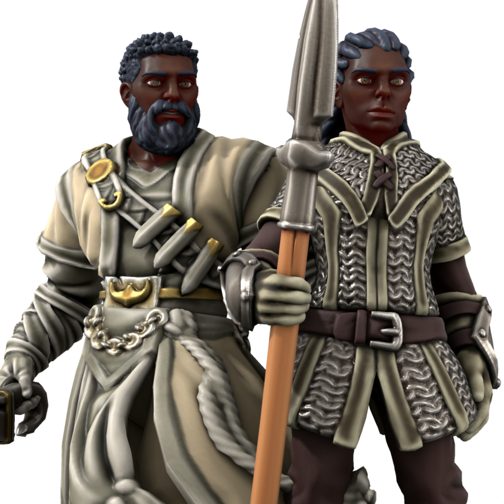

# Darmalahi

The Darmalahi (DAR-mah-lah-hee) began as a large family of [Gudzhé](/02_the_people/07_gudzhe.md) who were renowned for their impressive statures. In the days of the old Gudzhé empires, they rose to become a prominent group of mercenaries, serving any ruler who could afford their services.

Their height being a noteworthy feature, their leaders began a process of selection that lasted over many generations, choosing the tallest and strongest and accepting as payment marriages into their family based on traits they coveted. Over the course of hundreds of years, they grew to impressive size, uniformly tall and well-suited for battle.

After the formation of the last Gudzhé empire, they enjoyed a privileged place as elite warriors, a distinct group that had become large, numbering in the thousands.

The traditions that grew from hundreds of years of strict control of marriage and childbirth, as well as a fierce martial tradition, set them apart from the rest of society. With their status secure, they became insular and aloof from their Gudzhé kin.

Serving as a warrior class, the Darmalahi bore the brunt of the cataclysmic wars that saw the end of the last empire. Their numbers were decimated, and those who survived were scattered. Rare now, they exist in small communities on the fringes of the great nations, with the largest concentrated number living among the Ndaami. Their ancient traditions are mostly gone, but they remain insular and rarely mix with other peoples.

#### Appearance
Like their Gudzhé kin, the Darmalahi have ebony skin, black hair, and dark eyes. They are much larger physically, with both men and women ranging in height from 6½  to 7½ feet. They are strong and hearty, bred for the rigors of military life.

#### Religion
Many Darmalahi revere [Iylkumet](/03_cosmology/08_iylkumet_the_immortal_warrior.md) and [Ikaashivar](/03_cosmology/03_ikaashivar_the_penitent_simurgh.md) above all other aspects. They do not tend to gravitate toward the priesthood, but many serve as paladins, protecting their communities or traveling the world in search of just causes they can lend their skills to.

#### Ability Score Modifiers
Darmalahi get a +2 bonus to either Strength or Constitution, and a +1 bonus to one other ability score of their choice.

#### Size
Darmalahi are Medium creatures.

#### Base Speed
Darmalahi have a base speed of 35 feet.

#### Native Tongue
Darmalahi do not have a central homeland, but take on the language of the place they are raised. They may choose their native tongue from [Alauric](/languages_of_mishaqqa.md#alauric), [Gudzhoh](/languages_of_mishaqqa.md#gudzhoh), [Keshtowara](/languages_of_mishaqqa.md#keshtowara) (any dialect), or [Uilrim](/languages_of_mishaqqa.md#uilrim).

### Darmalahi Traits

#### Intimidating
Towering above others, Darmalahi strike an imposing figure.

You receive a +2 bonus on Intimidate skill checks against non-Darmalahi humans.

#### Bred For Combat
For thousands of years, the Darmalahi have spent their days in battle. Little can stop their ferocity.

Once per day, when a you are brought below 0 hit points but not killed, you can fight on for one more round as if disabled. At the end of your next turn, unless brought above 0 hit points, you immediately fall unconscious and begin dying.

#### Battle Reflexes
A life of training and battle hones the instincts of the Darmalahi warrior.

You gain a +2 trait bonus on initiative checks.