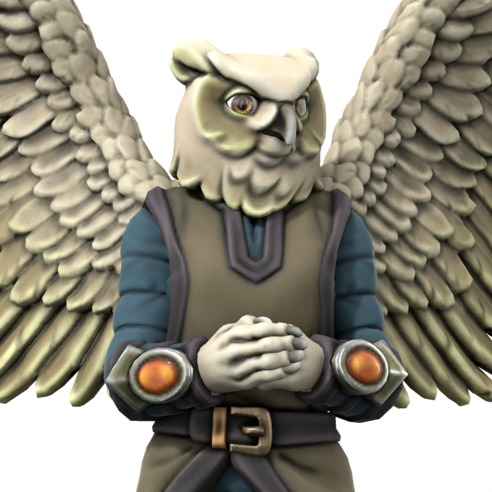

# Paru
## The Desert Owl

The aspect of fate, dreams, nightmares, and poets. Petitioned by those seeking luck or creativity, or warding off madness and ill dreams. Paru’s servants tend to be creative and gifted orators. Despite this, the aspect is known to speak very little when appearing in visions, instead leading seekers to scenes it wishes them to see and letting them interpret on their own. It appears as an otherwise unremarkable tawny desert owl.

### Domains
- Air
- Darkness
- Luck
- Madness

### Favored weapon
Kukri