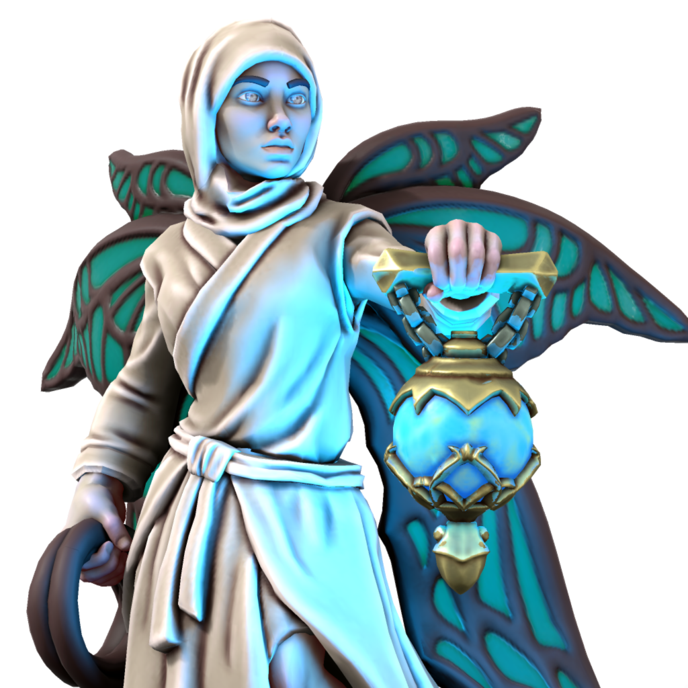

# Ayunas
## The Caravan Driver

Aspect of death and travel, Ayunas is petitioned by those seeking safe journeys, those who console the mourning, and necromancers. Ayunas is invoked in funerary rites, and is said to be the last face the dying see as she leads them to the Eternal Twilight, lighting the way with her lamp. The Caravan Driver appears as a peaceful woman clothed in a chador, with small luna moth wings, bearing a lantern that sheds a cool blue light.

### Domains
- Death
- Earth
- Repose
- Travel

### Favored weapon
Whip