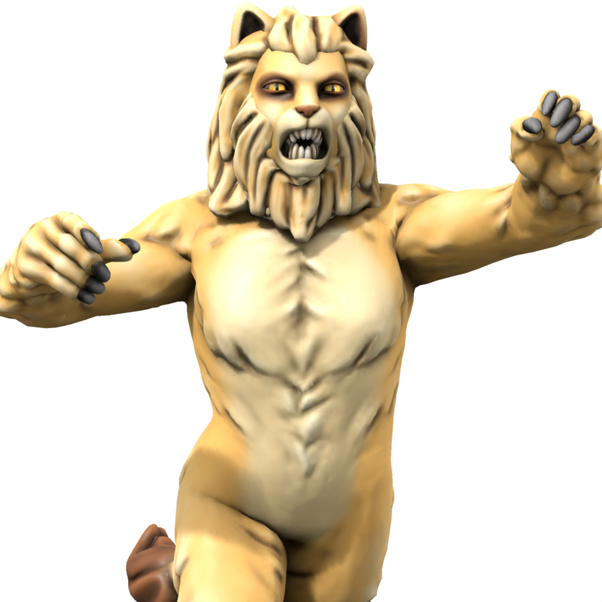

# Jayyak
## The Rampant Lion

Aspect of primal forces and wild places. Petitioned by hunters, druids, and those who lust. He is nature, red in tooth and claw. The Rampant Lion appears as a large male lion, and sometimes as a humanoid with strong leonine features.

### Domains
- Animal
- Earth
- Plant
- Weather

### Favored weapon
Scimitar