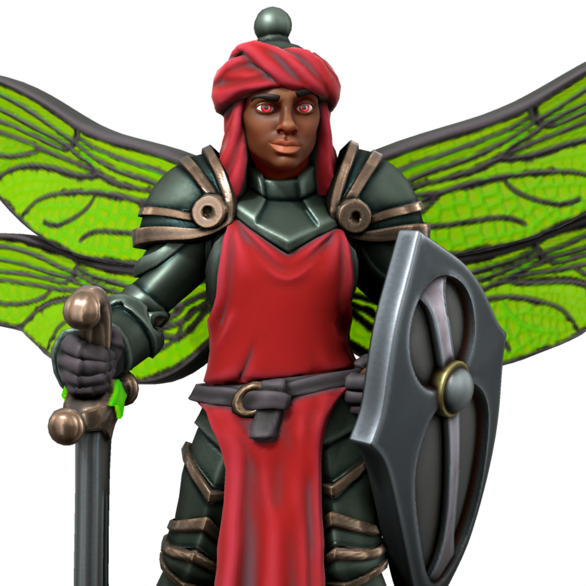

# Iylkumet
## The Immortal Warrior

Aspect of warfare and accomplishment. Iylkumet is petitioned by those who seek victory and mastery over themselves or others. They are confident and brave, never shying from battle, but never reveling in bloodlust. Noble and wise, Iylkumet is drawn to conflict, but not proud for it. The Immortal Warrior appears as a warrior of indeterminate gender, brash and young, with smooth features.

### Domains:
- Artifice
- Fire
- Nobility
- War

### Favored weapon
Kilij (Longsword)