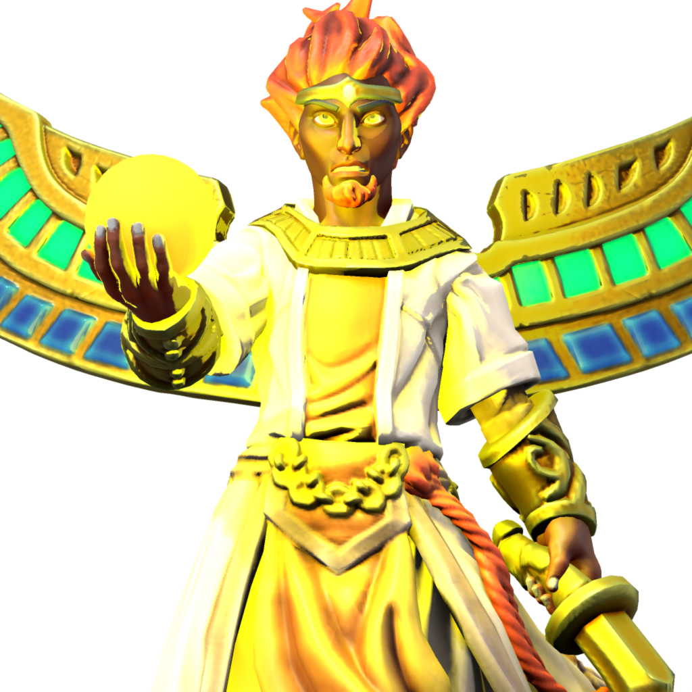

# Kalyaf
## The Sun Ascendant

Aspect of wealth and wrath. Kalyaf is anger personified, stern and unyeilding. Petitioned by those who seek riches or the destruction of their foes, his light is harsh and unkind to those who burn too long within it. The Sun Ascendant appears as a flame-haired man with bronze skin, severe and stern, accompanied by an orb glowing with the light of the sun that bathes and obscures him and all around him.

### Domains
- Destruction
- Fire
- Glory
- Sun

### Favored weapon
[Khopesh](../04_the_game/house_rules.md#new-weapons)