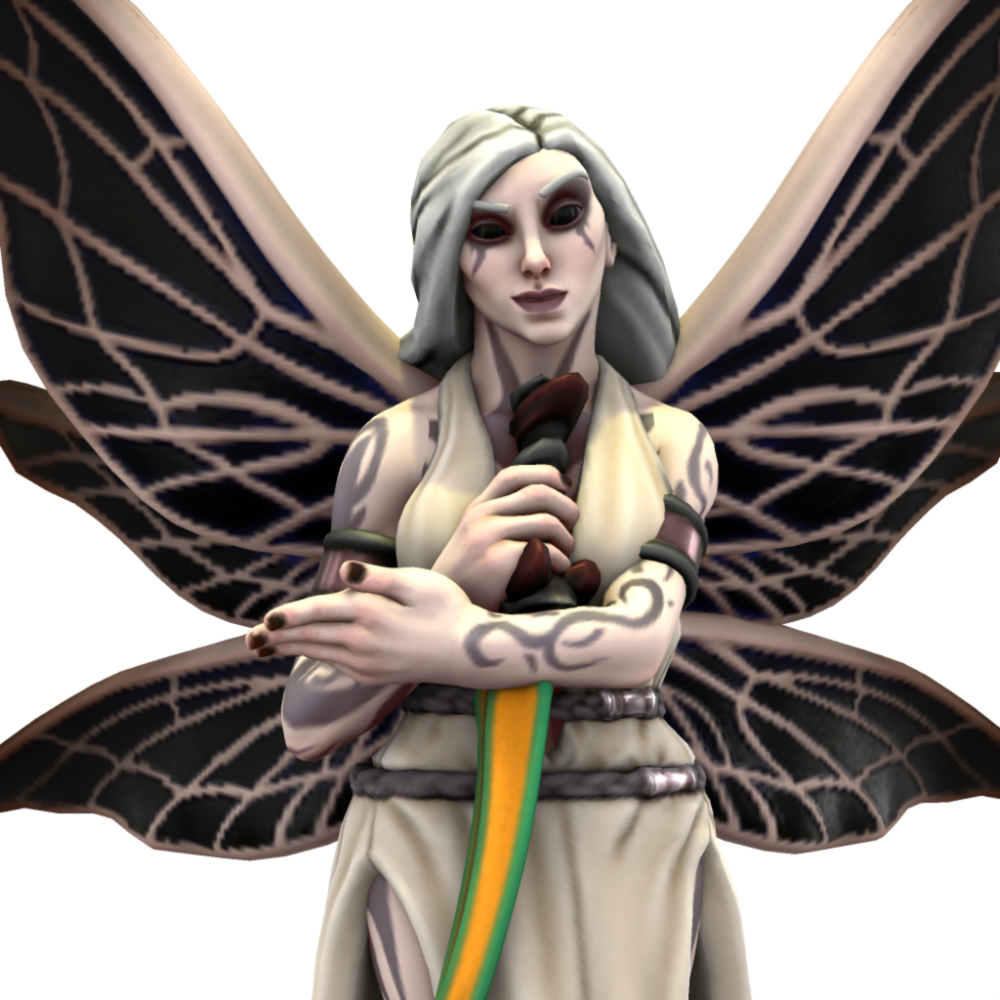

# Zhas’ni, The Whisperer in Shadow

A rogue aspect of the Konun Oluhiyat, Zhas’ni is an agent of chaos and corruption. Banished to the Eternal Twilight, she still manages to find subtle ways to sway the hearts of humanity, twisting them to her machinations in an attempt to secure her freedom. Zhas’ni appears as a stunningly beautiful Meh’teyar woman with flowing silver hair, bleached white skin covered in intricate tattoos, and jet-black eyes of endless depth. She is served by a host of powerful beings, corrupted ancient Meh’teyar sorcerers and priests who are no longer even remotely human.

## Alignment
Zhas’ni is chaos and evil incarnate.

## Worshippers
There are very few who openly worship Zhas’ni, but many have heard her whispering and work her will unknowingly. The people of Mishaqqa attribute all malice and evil in the world to her, a sentiment that he is not displeased with.

## Priesthood
Only the most twisted and ambitious serve Zhas’ni directly. Some lead twisted cults, others work alone in darkness, seeking to summon her servants to help bring about an end to her exile from the Eternal Twilight. 

## Domains
Clerics of Zhas’ni select their domains from her list. Zhas’ni has no druids or paladins.
- Chaos
- Darkness
- Evil
- Trickery

## Favored weapon
Peshkabz (dagger)
